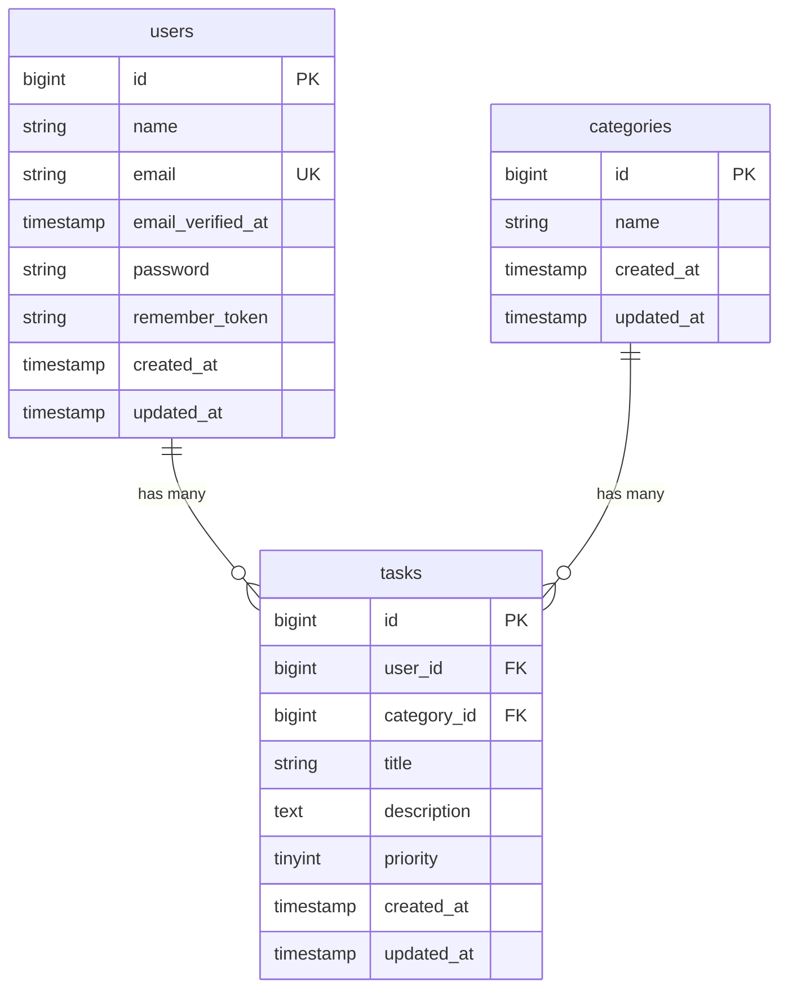

# COACHTECH タスク管理アプリ

COACHTECH課題のタスク管理アプリです。
タスクの登録、一覧の表示、更新、削除ができます。
カテゴリの登録、一覧の表示、更新、削除も可能です。
また、キーワード検索やCSV出力も追加しました。

## 作成者

志賀 由美子

## 使用技術

- PHP 8.5
- Laravel
- MySQL 8.4
- phpMyAdmin
- Laravel Sail
- Docker
- Tailwind CSS
- Vite

## ER図



## 開発環境URL

http://localhost

## 動作環境

Docker Desktopを使用したDocker環境で動作します。
Laravel Sailを使用してLaravel、MySQLなどの開発環境を構築しています。
フロントエンドにはViteおよびTailwind CSSを使用しています。

## 環境構築手順

1. **リポジトリをクローン**

```bash
$ git clone https://github.com/totosmy2718-netizen/task-manager4
```

2. **.envファイルの準備**

`.env.example`をコピーして`.env`を作成

```bash
$ cp .env.example .env
```

3. **Composer依存パッケージのインストール**

```bash
$ docker run --rm \
  -u "$(id -u):$(id -g)" \
  -v "$(pwd):/var/www/html" \
  -w /var/www/html \
  -e COMPOSER_CACHE_DIR=/tmp/composer_cache \
  laravelsail/php82-composer:latest \
  composer install --ignore-platform-reqs
```

4. **Laravel Sailの起動**

Docker Desktopを起動した状態で、Laravel Sailを起動

```bash
$ ./vendor/bin/sail up -d
```

5. **アプリケーションキーの生成**

Laravelのアプリケーションキーを生成

```bash
$ sail artisan key:generate
```

6.  **データベースのマイグレーションと初期データ投入**

データベースのテーブルを作成

```bash
$ sail artisan migrate
```

初期データ（カテゴリ）を登録

```bash
$ sail artisan db:seed
```

7. **フロントエンドのビルド**

NPM依存パッケージをインストール

```bash
$ sail npm install
```

Tailwind CSS、PostCSS、Autoprefixerをインストール

```bash
$ sail npm install -D tailwindcss@^3.4.0 postcss autoprefixer
```

開発中はVite開発サーバーを起動したままにしておく（ターミナルを新規で開く）

```bash
$ sail npm run dev
```

8. **アプリケーションへのアクセス**

ブラウザで以下のURLにアクセス
http://localhost

## テスト実行

```bash
$ sail artisan test
```

## 機能一覧

- ユーザー認証
- タスクの一覧表示
- タスクの登録
- タスクの詳細表示
- タスクの編集
- タスクの削除
- カテゴリーの一覧表示
- カテゴリーの登録
- カテゴリーの詳細表示
- カテゴリーの編集
- カテゴリーの削除
- タスクとカテゴリーの紐付け
- カテゴリーごとのタスク数表示
- タスクが紐づいているカテゴリーの削除防止
- タスクの優先度設定
- タスク・カテゴリーの入力値バリデーション
- Task Policyによるタスクの認可制御

## APIエンドポイント一覧

認証不要のAPIです

| HTTPメソッド | URI                 | 概要             |
| ------------ | ------------------- | ---------------- |
| GET          | `/api/tasks`        | タスク一覧を取得 |
| GET          | `/api/tasks/{task}` | タスク詳細を取得 |
